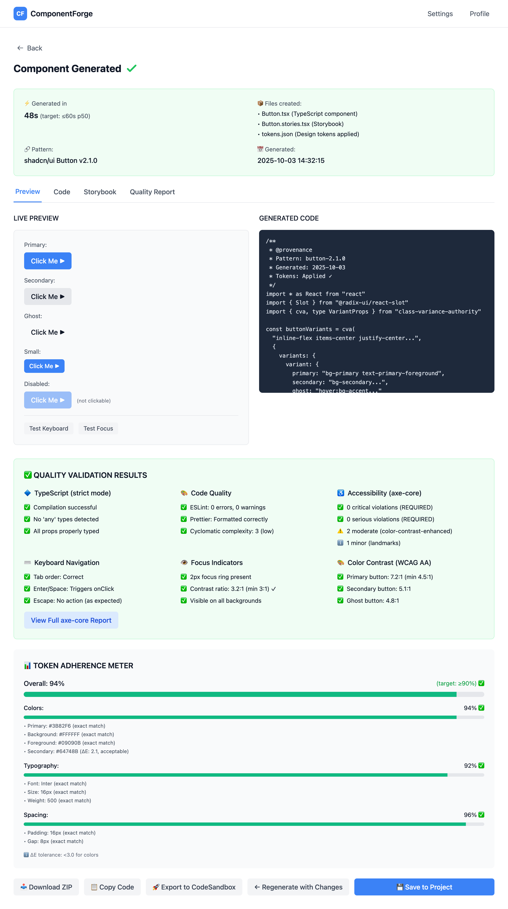

# Epic 5: Quality Validation & Testing

**Status**: Not Started
**Priority**: Critical
**Epic Owner**: QA/Frontend Team
**Estimated Tasks**: 9
**Depends On**: Epic 4 (Code Generation)

---

## Overview

Build automated quality validation system that ensures every generated component meets accessibility standards, type safety requirements, code quality guidelines, and design token adherence. Includes auto-fix capabilities with retry logic and comprehensive quality reporting.

---

## Goals

1. Validate TypeScript compilation (strict mode)
2. Run ESLint and Prettier validation
3. Execute axe-core accessibility testing (0 critical violations)
4. Test keyboard navigation and focus management
5. Verify focus indicators are visible
6. Check color contrast compliance (WCAG AA)
7. Calculate token adherence meter (≥90% target)
8. Implement auto-fix with single retry for failures
9. Generate comprehensive quality reports

---

## Success Criteria

- ✅ TypeScript strict compilation succeeds (required)
- ✅ ESLint validation passes with zero errors
- ✅ Prettier formatting verified
- ✅ axe-core audit shows 0 critical violations (required)
- ✅ 0 serious violations (required)
- ✅ Keyboard navigation works (Tab, Enter, Space, Escape)
- ✅ Focus indicators visible with ≥3:1 contrast
- ✅ Color contrast meets WCAG AA (4.5:1 text, 3:1 UI)
- ✅ Token adherence ≥90% (colors, typography, spacing)
- ✅ Auto-fix resolves 80%+ of fixable issues
- ✅ Quality report generated with all metrics
- ✅ Validation completes in <10s

---

## Wireframe

### Interactive Prototype
**View HTML:** [component-preview-page.html](../wireframes/component-preview-page.html) *(shares same page with Epic 4, validation section)*



### Key UI Elements

**Validation Progress** (Runs after generation)
- Progress bar with validation stages
  - TypeScript Compilation → Task 1
  - ESLint & Prettier → Task 2
  - axe-core A11y Test → Task 3
  - Keyboard Navigation → Task 4
  - Focus Indicators → Task 5
  - Color Contrast → Task 6
  - Token Adherence → Task 7
- Auto-fix indicator → Task 8: Auto-Fix & Retry Logic
- Elapsed time (target: <10s)

**Quality Scorecard** (Top summary)
- Overall status: PASS / FAIL
- Critical checks:
  - ✓ TypeScript: Compiled successfully
  - ✓ ESLint: 0 errors, 2 warnings
  - ✓ Accessibility: 0 critical/serious violations
  - ✓ Token Adherence: 94%
- Auto-fixes applied: 3 issues resolved

**Validation Results** (Tabbed sections)

**TypeScript Tab** → Task 1: TypeScript Compilation Check
- Compilation status
- Errors/warnings with line numbers
- Type coverage report
- Auto-fixes applied (unused imports removed)

**Code Quality Tab** → Task 2: ESLint & Prettier Validation
- ESLint results by severity
- Prettier formatting status
- Auto-fixed issues list

**Accessibility Tab** → Task 3, 4, 5, 6
- axe-core audit summary → Task 3: axe-core Accessibility Testing
  - 0 critical violations ✓
  - 0 serious violations ✓
  - 2 moderate issues (warnings only)
- Keyboard navigation results → Task 4: Keyboard Navigation Testing
  - Tab order visualization
  - Enter/Space activation test
- Focus indicators → Task 5: Focus Indicator Validation
  - Contrast ratio: 3.2:1 ✓
  - Visibility check passed
- Color contrast → Task 6: Color Contrast Validation
  - All text: 4.8:1 (WCAG AA ✓)
  - UI components: 3.5:1 ✓
  - Violations: None

**Token Adherence Tab** → Task 7: Token Adherence Meter
- Overall score: 94% ✓ (target: ≥90%)
- By category:
  - Colors: 96% (23/24 matches)
  - Typography: 95% (19/20 matches)
  - Spacing: 91% (21/23 matches)
- Violations list with expected vs actual
- ΔE tolerance visualization (≤2.0)

**Quality Report** → Task 9: Quality Report Generation
- Downloadable HTML/JSON report
- All metrics and details
- Timestamp and component metadata
- Recommendations for improvements

**Auto-Fix Summary** → Task 8: Auto-Fix & Retry Logic
- Issues automatically fixed: 3
  - Removed unused import (React)
  - Added aria-label to icon button
  - Formatted with Prettier
- Retry validation: Passed ✓
- Manual fixes needed: 0

**Action Buttons**
- "Download Report" (HTML/JSON)
- "Accept & Export Component"
- "Fix Issues Manually" (if validation failed)
- "Regenerate Component" (if major issues)

### User Flow
1. Validation starts automatically after code generation
2. Progress bar shows real-time validation stages
3. Auto-fix attempts to resolve common issues
4. Validation retries after auto-fixes
5. Quality scorecard displays overall status
6. User reviews detailed results by category
7. User downloads quality report
8. User accepts component (if PASS) or fixes issues (if FAIL)

**Validation Requirements:**
- **Blockers** (must pass):
  - TypeScript compilation
  - 0 critical/serious a11y violations
  - Token adherence ≥90%
- **Warnings** (allow but flag):
  - ESLint warnings
  - Moderate a11y issues
  - Minor token deviations

**Performance Display:**
- Validation latency (target: <10s)
- Auto-fix success rate (target: ≥80%)

**Quick Test:**
```bash
# View wireframe locally
open .claude/wireframes/component-preview-page.html
```

---

## Tasks

### Task 1: TypeScript Compilation Check
**Acceptance Criteria**:
- [ ] Run `tsc --noEmit` on generated component
- [ ] Use strict mode configuration:
  - `strict: true`
  - `noImplicitAny: true`
  - `strictNullChecks: true`
  - `noUnusedLocals: true`
  - `noUnusedParameters: true`
- [ ] Capture compilation errors with line numbers
- [ ] Parse error messages for actionable feedback
- [ ] Return detailed error report if compilation fails
- [ ] Auto-fix: Remove unused imports, add missing type annotations
- [ ] Retry compilation after auto-fix
- [ ] Block component delivery if compilation fails after retry

**Files**:
- `backend/src/validation/typescript_validator.py`
- `backend/tsconfig.validation.json`

**TypeScript Validation**:
```python
import asyncio
import json
from pathlib import Path

class TypeScriptValidator:
    def __init__(self, tsconfig_path: str):
        self.tsconfig_path = tsconfig_path

    async def validate(self, code: str, file_path: str) -> dict:
        """Validate TypeScript compilation."""
        # Write code to temp file
        temp_file = Path(f"/tmp/{file_path}")
        temp_file.write_text(code)

        # Run tsc
        result = await self._run_tsc(temp_file)

        if result["success"]:
            return {
                "valid": True,
                "errors": []
            }

        # Attempt auto-fix
        fixed_code = await self._auto_fix(code, result["errors"])
        if fixed_code:
            retry_result = await self._run_tsc_on_code(fixed_code)
            if retry_result["success"]:
                return {
                    "valid": True,
                    "auto_fixed": True,
                    "fixed_code": fixed_code
                }

        return {
            "valid": False,
            "errors": result["errors"],
            "auto_fix_attempted": True
        }

    async def _run_tsc(self, file_path: Path) -> dict:
        """Run TypeScript compiler."""
        process = await asyncio.create_subprocess_exec(
            'npx', 'tsc', '--noEmit',
            '--project', self.tsconfig_path,
            str(file_path),
            stdout=asyncio.subprocess.PIPE,
            stderr=asyncio.subprocess.PIPE
        )
        stdout, stderr = await process.communicate()

        if process.returncode == 0:
            return {"success": True, "errors": []}

        errors = self._parse_tsc_errors(stderr.decode())
        return {"success": False, "errors": errors}

    def _parse_tsc_errors(self, output: str) -> list[dict]:
        """Parse TypeScript compiler errors."""
        errors = []
        for line in output.split('\n'):
            if ': error TS' in line:
                parts = line.split(':')
                errors.append({
                    "line": parts[1].strip() if len(parts) > 1 else None,
                    "code": self._extract_error_code(line),
                    "message": self._extract_error_message(line)
                })
        return errors

    async def _auto_fix(self, code: str, errors: list[dict]) -> str | None:
        """Attempt to auto-fix common TypeScript errors."""
        # Remove unused imports
        if any('is declared but never used' in e['message'] for e in errors):
            code = self._remove_unused_imports(code)

        # Add missing type annotations
        if any('implicitly has an' in e['message'] for e in errors):
            code = self._add_type_annotations(code)

        return code
```

**Tests**:
- Valid TypeScript compiles successfully
- Compilation errors detected correctly
- Auto-fix removes unused imports
- Auto-fix adds type annotations
- Retry logic works

---

### Task 2: ESLint & Prettier Validation
**Acceptance Criteria**:
- [ ] Run ESLint with TypeScript parser
- [ ] Use recommended rulesets:
  - `eslint:recommended`
  - `plugin:@typescript-eslint/recommended`
  - `plugin:react/recommended`
  - `plugin:react-hooks/recommended`
- [ ] Check code formatting with Prettier
- [ ] Report errors by severity (error, warning)
- [ ] Auto-fix: Run `eslint --fix` and `prettier --write`
- [ ] Retry validation after auto-fix
- [ ] Allow warnings but block on errors
- [ ] Generate formatted code output

**Files**:
- `backend/src/validation/eslint_validator.py`
- `backend/.eslintrc.json`
- `backend/.prettierrc.json`

**ESLint Validation**:
```python
class ESLintValidator:
    async def validate(self, code: str, file_path: str) -> dict:
        """Validate code with ESLint and Prettier."""
        # Write to temp file
        temp_file = Path(f"/tmp/{file_path}")
        temp_file.write_text(code)

        # Run ESLint
        eslint_result = await self._run_eslint(temp_file)

        if not eslint_result["valid"]:
            # Attempt auto-fix
            await self._run_eslint_fix(temp_file)
            fixed_code = temp_file.read_text()

            # Retry validation
            retry_result = await self._run_eslint(temp_file)
            eslint_result = retry_result
            eslint_result["fixed_code"] = fixed_code

        # Run Prettier
        prettier_result = await self._run_prettier(temp_file)

        return {
            "eslint": eslint_result,
            "prettier": prettier_result
        }

    async def _run_eslint(self, file_path: Path) -> dict:
        """Run ESLint on file."""
        process = await asyncio.create_subprocess_exec(
            'npx', 'eslint',
            '--format', 'json',
            str(file_path),
            stdout=asyncio.subprocess.PIPE,
            stderr=asyncio.subprocess.PIPE
        )
        stdout, stderr = await process.communicate()

        if process.returncode == 0:
            return {"valid": True, "errors": [], "warnings": []}

        results = json.loads(stdout.decode())
        errors = [m for m in results[0]['messages']
                 if m['severity'] == 2]
        warnings = [m for m in results[0]['messages']
                   if m['severity'] == 1]

        return {
            "valid": len(errors) == 0,
            "errors": errors,
            "warnings": warnings
        }

    async def _run_eslint_fix(self, file_path: Path):
        """Run ESLint with --fix."""
        await asyncio.create_subprocess_exec(
            'npx', 'eslint', '--fix', str(file_path)
        )

    async def _run_prettier(self, file_path: Path) -> dict:
        """Check Prettier formatting."""
        process = await asyncio.create_subprocess_exec(
            'npx', 'prettier', '--check', str(file_path),
            stdout=asyncio.subprocess.PIPE,
            stderr=asyncio.subprocess.PIPE
        )
        await process.communicate()

        if process.returncode == 0:
            return {"valid": True}

        # Auto-fix: format with Prettier
        await asyncio.create_subprocess_exec(
            'npx', 'prettier', '--write', str(file_path)
        )

        return {"valid": True, "auto_fixed": True}
```

**Tests**:
- ESLint detects errors correctly
- ESLint auto-fix resolves issues
- Prettier formatting works
- Auto-fix and retry logic correct

---

### Task 3: axe-core Accessibility Testing
**Acceptance Criteria**:
- [ ] Render component in headless browser (Playwright)
- [ ] Run axe-core accessibility audit
- [ ] Test all component variants and states
- [ ] Report violations by severity:
  - Critical (0 allowed)
  - Serious (0 allowed)
  - Moderate (warn only)
  - Minor (warn only)
- [ ] Capture violation details:
  - Rule ID (e.g., `button-name`, `color-contrast`)
  - Impact level
  - Element selector
  - Fix suggestions
- [ ] Block component delivery on critical/serious violations
- [ ] Generate accessibility report

**Files**:
- `backend/src/validation/a11y_validator.py`

**axe-core Validation**:
```python
from playwright.async_api import async_playwright
import json

class A11yValidator:
    async def validate(self, component_code: str,
                      component_name: str) -> dict:
        """Run axe-core accessibility tests."""
        async with async_playwright() as p:
            browser = await p.chromium.launch()
            page = await browser.new_page()

            # Create test page with component
            html = self._create_test_page(component_code, component_name)
            await page.set_content(html)

            # Inject axe-core
            await page.add_script_tag(
                url='https://cdnjs.cloudflare.com/ajax/libs/axe-core/4.7.0/axe.min.js'
            )

            # Run axe
            results = await page.evaluate('axe.run()')

            await browser.close()

            return self._process_results(results)

    def _create_test_page(self, component_code: str,
                         component_name: str) -> str:
        """Create HTML page for testing."""
        return f"""
<!DOCTYPE html>
<html lang="en">
<head>
  <meta charset="UTF-8">
  <title>A11y Test</title>
</head>
<body>
  <div id="root"></div>
  <script type="module">
    {component_code}

    // Render all variants
    import React from 'react';
    import ReactDOM from 'react-dom';
    import {{ {component_name} }} from './component';

    ReactDOM.render(
      <div>
        <{component_name} variant="primary">Primary</{component_name}>
        <{component_name} variant="secondary">Secondary</{component_name}>
        <{component_name} disabled>Disabled</{component_name}>
      </div>,
      document.getElementById('root')
    );
  </script>
</body>
</html>
"""

    def _process_results(self, results: dict) -> dict:
        """Process axe-core results."""
        violations = results.get('violations', [])

        critical = [v for v in violations if v['impact'] == 'critical']
        serious = [v for v in violations if v['impact'] == 'serious']
        moderate = [v for v in violations if v['impact'] == 'moderate']
        minor = [v for v in violations if v['impact'] == 'minor']

        return {
            "valid": len(critical) == 0 and len(serious) == 0,
            "violations": {
                "critical": critical,
                "serious": serious,
                "moderate": moderate,
                "minor": minor
            },
            "summary": {
                "critical_count": len(critical),
                "serious_count": len(serious),
                "moderate_count": len(moderate),
                "minor_count": len(minor),
                "total_count": len(violations)
            }
        }
```

**Tests**:
- axe-core detects violations
- Critical violations block delivery
- All variants tested
- Report format correct

---

### Task 4: Keyboard Navigation Testing
**Acceptance Criteria**:
- [ ] Test Tab key navigation through interactive elements
- [ ] Verify correct tab order
- [ ] Test Enter/Space activation for buttons
- [ ] Test Escape key for dismissible components
- [ ] Test Arrow keys for navigation (tabs, select, etc.)
- [ ] Verify focus trap for modals
- [ ] Test skip links if present
- [ ] Ensure no keyboard traps
- [ ] Report keyboard navigation issues

**Files**:
- `backend/src/validation/keyboard_validator.py`

**Keyboard Testing**:
```python
class KeyboardValidator:
    async def validate(self, component_code: str,
                      component_name: str,
                      component_type: str) -> dict:
        """Test keyboard navigation."""
        async with async_playwright() as p:
            browser = await p.chromium.launch()
            page = await browser.new_page()

            html = self._create_test_page(component_code, component_name)
            await page.set_content(html)

            issues = []

            # Test Tab navigation
            tab_issues = await self._test_tab_navigation(page, component_type)
            issues.extend(tab_issues)

            # Test activation keys (Enter/Space)
            if component_type in ['button', 'link']:
                activation_issues = await self._test_activation(page)
                issues.extend(activation_issues)

            await browser.close()

            return {
                "valid": len(issues) == 0,
                "issues": issues
            }

    async def _test_tab_navigation(self, page, component_type: str):
        """Test Tab key navigation."""
        issues = []

        # Press Tab
        await page.keyboard.press('Tab')

        # Check if component received focus
        focused = await page.evaluate('document.activeElement.tagName')

        if component_type == 'button' and focused != 'BUTTON':
            issues.append({
                "type": "tab_navigation",
                "message": "Button not focusable with Tab key",
                "severity": "critical"
            })

        return issues

    async def _test_activation(self, page):
        """Test Enter/Space activation."""
        issues = []

        # Setup click listener
        await page.evaluate('''
            window.clicked = false;
            document.activeElement.addEventListener('click', () => {
                window.clicked = true;
            });
        ''')

        # Press Enter
        await page.keyboard.press('Enter')
        clicked = await page.evaluate('window.clicked')

        if not clicked:
            issues.append({
                "type": "keyboard_activation",
                "message": "Element not activated by Enter key",
                "severity": "serious"
            })

        return issues
```

**Tests**:
- Tab navigation works correctly
- Enter/Space activates elements
- Keyboard traps detected
- Focus order validated

---

### Task 5: Focus Indicator Validation
**Acceptance Criteria**:
- [ ] Verify focus indicator is visible
- [ ] Check focus indicator contrast (≥3:1 against background)
- [ ] Test focus indicator on all interactive elements
- [ ] Verify focus-visible styles applied
- [ ] Check focus indicator is not removed with `outline: none`
- [ ] Ensure custom focus styles meet WCAG standards
- [ ] Test focus indicator in different states (hover, active)
- [ ] Report missing or insufficient focus indicators

**Files**:
- `backend/src/validation/focus_validator.py`

**Focus Indicator Testing**:
```python
class FocusValidator:
    async def validate(self, component_code: str,
                      component_name: str) -> dict:
        """Validate focus indicators."""
        async with async_playwright() as p:
            browser = await p.chromium.launch()
            page = await browser.new_page()

            html = self._create_test_page(component_code, component_name)
            await page.set_content(html)

            # Focus element
            await page.keyboard.press('Tab')

            # Get computed styles
            styles = await page.evaluate('''
                () => {
                    const el = document.activeElement;
                    const computed = window.getComputedStyle(el);
                    return {
                        outline: computed.outline,
                        outlineWidth: computed.outlineWidth,
                        outlineColor: computed.outlineColor,
                        boxShadow: computed.boxShadow
                    };
                }
            ''')

            # Check for focus indicator
            has_indicator = (
                styles['outlineWidth'] != '0px' or
                'ring' in styles['boxShadow']
            )

            issues = []
            if not has_indicator:
                issues.append({
                    "type": "missing_focus_indicator",
                    "message": "No visible focus indicator detected",
                    "severity": "critical"
                })

            # Check contrast if indicator present
            if has_indicator:
                contrast_issues = await self._check_focus_contrast(page)
                issues.extend(contrast_issues)

            await browser.close()

            return {
                "valid": len(issues) == 0,
                "issues": issues,
                "styles": styles
            }

    async def _check_focus_contrast(self, page):
        """Check focus indicator contrast ratio."""
        # Get colors and calculate contrast
        # Implementation depends on color parsing library
        pass
```

**Tests**:
- Focus indicators detected
- Contrast ratio calculated correctly
- Missing indicators reported
- Custom focus styles validated

---

### Task 6: Color Contrast Validation
**Acceptance Criteria**:
- [ ] Extract all text and UI element colors from component
- [ ] Calculate contrast ratios using WCAG formula
- [ ] Validate against WCAG AA standards:
  - Normal text: ≥4.5:1
  - Large text (≥18pt or 14pt bold): ≥3:1
  - UI components: ≥3:1
- [ ] Test contrast in all states (default, hover, focus, disabled)
- [ ] Report violations with actual vs required ratios
- [ ] Suggest alternative colors that meet standards
- [ ] Auto-fix: Adjust colors to meet minimum contrast

**Files**:
- `backend/src/validation/contrast_validator.py`

**Contrast Validation**:
```python
from colour import Color
import math

class ContrastValidator:
    def validate(self, component_code: str, tokens: dict) -> dict:
        """Validate color contrast ratios."""
        violations = []

        # Extract color pairs from component
        color_pairs = self._extract_color_pairs(component_code, tokens)

        for pair in color_pairs:
            ratio = self._calculate_contrast_ratio(
                pair['foreground'],
                pair['background']
            )

            required_ratio = self._get_required_ratio(pair['context'])

            if ratio < required_ratio:
                violations.append({
                    "type": "insufficient_contrast",
                    "element": pair['element'],
                    "foreground": pair['foreground'],
                    "background": pair['background'],
                    "actual_ratio": round(ratio, 2),
                    "required_ratio": required_ratio,
                    "severity": "critical" if ratio < 3.0 else "serious"
                })

        return {
            "valid": len(violations) == 0,
            "violations": violations
        }

    def _calculate_contrast_ratio(self, fg: str, bg: str) -> float:
        """Calculate WCAG contrast ratio."""
        fg_color = Color(fg)
        bg_color = Color(bg)

        fg_luminance = self._get_relative_luminance(fg_color)
        bg_luminance = self._get_relative_luminance(bg_color)

        lighter = max(fg_luminance, bg_luminance)
        darker = min(fg_luminance, bg_luminance)

        return (lighter + 0.05) / (darker + 0.05)

    def _get_relative_luminance(self, color: Color) -> float:
        """Calculate relative luminance."""
        r, g, b = color.rgb

        def adjust(c):
            if c <= 0.03928:
                return c / 12.92
            return ((c + 0.055) / 1.055) ** 2.4

        r = adjust(r)
        g = adjust(g)
        b = adjust(b)

        return 0.2126 * r + 0.7152 * g + 0.0722 * b

    def _get_required_ratio(self, context: str) -> float:
        """Get required contrast ratio for context."""
        if context == 'large_text':
            return 3.0
        elif context == 'ui_component':
            return 3.0
        else:  # normal_text
            return 4.5

    def _extract_color_pairs(self, code: str, tokens: dict):
        """Extract foreground/background color pairs from code."""
        # Parse code to find text elements and their colors
        pairs = []
        # Implementation depends on AST parsing
        return pairs
```

**Tests**:
- Contrast ratios calculated correctly
- WCAG standards enforced
- Violations detected accurately
- Auto-fix suggestions valid

---

### Task 7: Token Adherence Meter
**Acceptance Criteria**:
- [ ] Compare generated component against approved tokens
- [ ] Check token usage for:
  - Colors (all color values)
  - Typography (font family, sizes, weights)
  - Spacing (padding, margin, gap values)
- [ ] Calculate adherence percentage per category
- [ ] Calculate overall adherence score (≥90% target)
- [ ] Report non-compliant values with expected vs actual
- [ ] Generate visual adherence report
- [ ] Allow tolerance for minor variations (ΔE ≤2 for colors)

**Files**:
- `backend/src/validation/token_validator.py`

**Token Adherence**:
```python
class TokenValidator:
    def validate(self, component_code: str, approved_tokens: dict) -> dict:
        """Calculate token adherence."""
        # Extract tokens from generated code
        used_tokens = self._extract_used_tokens(component_code)

        adherence = {
            "colors": self._check_color_adherence(
                used_tokens.get("colors", {}),
                approved_tokens.get("colors", {})
            ),
            "typography": self._check_typography_adherence(
                used_tokens.get("typography", {}),
                approved_tokens.get("typography", {})
            ),
            "spacing": self._check_spacing_adherence(
                used_tokens.get("spacing", {}),
                approved_tokens.get("spacing", {})
            )
        }

        # Calculate overall score
        scores = [cat["score"] for cat in adherence.values()]
        overall_score = sum(scores) / len(scores) if scores else 0

        return {
            "valid": overall_score >= 0.90,
            "overall_score": overall_score,
            "adherence": adherence,
            "violations": self._collect_violations(adherence)
        }

    def _check_color_adherence(self, used: dict, approved: dict) -> dict:
        """Check color token adherence."""
        matches = 0
        total = len(used)

        violations = []
        for name, used_value in used.items():
            approved_value = approved.get(name)
            if not approved_value:
                violations.append({
                    "token": name,
                    "issue": "not_in_approved_tokens",
                    "used": used_value
                })
                continue

            # Calculate color difference (ΔE)
            delta_e = self._calculate_delta_e(used_value, approved_value)

            if delta_e <= 2.0:  # Tolerance
                matches += 1
            else:
                violations.append({
                    "token": name,
                    "issue": "color_mismatch",
                    "used": used_value,
                    "approved": approved_value,
                    "delta_e": round(delta_e, 2)
                })

        return {
            "score": matches / total if total > 0 else 1.0,
            "matches": matches,
            "total": total,
            "violations": violations
        }

    def _calculate_delta_e(self, color1: str, color2: str) -> float:
        """Calculate ΔE color difference (CIEDE2000)."""
        # Use colour library for ΔE calculation
        from colour import delta_E
        return delta_E(color1, color2, method='CIE 2000')

    def _extract_used_tokens(self, code: str) -> dict:
        """Extract token values from generated code."""
        # Parse CSS variables and inline values
        # Implementation depends on CSS parser
        return {}
```

**Tests**:
- Token extraction correct
- Adherence calculated accurately
- ΔE tolerance works
- Overall score matches expectations

---

### Task 8: Auto-Fix & Retry Logic
**Acceptance Criteria**:
- [ ] Implement auto-fix for common issues:
  - TypeScript: Remove unused imports, add type annotations
  - ESLint: Run `eslint --fix`
  - Prettier: Run `prettier --write`
  - Accessibility: Add missing ARIA labels
  - Contrast: Adjust colors to meet minimum ratios
- [ ] Retry validation after auto-fix (one attempt)
- [ ] Track which issues were auto-fixed
- [ ] Report auto-fix success rate
- [ ] Generate diff showing changes
- [ ] Provide manual fix suggestions for unfixable issues
- [ ] Target: 80%+ auto-fix success rate

**Files**:
- `backend/src/validation/auto_fixer.py`

**Auto-Fix Logic**:
```python
class AutoFixer:
    async def fix_and_retry(self, code: str,
                           validation_result: dict) -> dict:
        """Attempt to auto-fix issues and retry validation."""
        fixed_code = code
        fixes_applied = []

        # Fix TypeScript issues
        if not validation_result.get("typescript", {}).get("valid"):
            fixed_code, ts_fixes = await self._fix_typescript(
                fixed_code,
                validation_result["typescript"]["errors"]
            )
            fixes_applied.extend(ts_fixes)

        # Fix ESLint issues
        if not validation_result.get("eslint", {}).get("valid"):
            fixed_code, lint_fixes = await self._fix_eslint(fixed_code)
            fixes_applied.extend(lint_fixes)

        # Format with Prettier
        fixed_code = await self._format_prettier(fixed_code)
        fixes_applied.append("prettier_format")

        # Fix accessibility issues
        if validation_result.get("a11y", {}).get("violations"):
            fixed_code, a11y_fixes = await self._fix_a11y(
                fixed_code,
                validation_result["a11y"]["violations"]
            )
            fixes_applied.extend(a11y_fixes)

        # Retry validation
        retry_result = await self.validator.validate_all(fixed_code)

        return {
            "fixed_code": fixed_code,
            "fixes_applied": fixes_applied,
            "retry_result": retry_result,
            "success": retry_result["valid"]
        }

    async def _fix_a11y(self, code: str, violations: dict) -> tuple[str, list]:
        """Fix accessibility violations."""
        fixes = []

        # Add missing aria-labels
        for violation in violations.get("critical", []):
            if violation["id"] == "button-name":
                # Add aria-label to buttons without text
                code = self._add_aria_label(code, violation)
                fixes.append("add_aria_label")

        return code, fixes
```

**Tests**:
- Auto-fix resolves common issues
- Retry validation works
- Fixes tracked correctly
- Success rate measured

---

### Task 9: Quality Report Generation
**Acceptance Criteria**:
- [ ] Generate comprehensive quality report with:
  - Overall pass/fail status
  - TypeScript compilation result
  - ESLint/Prettier results
  - Accessibility audit summary
  - Keyboard navigation results
  - Focus indicator validation
  - Color contrast results
  - Token adherence score
  - Auto-fix summary
- [ ] Include visualizations (charts, badges)
- [ ] Export report in JSON and HTML formats
- [ ] Store report in S3
- [ ] Display report in UI
- [ ] Track quality metrics over time

**Files**:
- `backend/src/validation/report_generator.py`

**Report Generation**:
```python
class QualityReportGenerator:
    def generate(self, validation_results: dict) -> dict:
        """Generate quality report."""
        report = {
            "timestamp": datetime.utcnow().isoformat(),
            "overall_status": self._determine_status(validation_results),
            "summary": {
                "typescript": validation_results["typescript"]["valid"],
                "eslint": validation_results["eslint"]["valid"],
                "accessibility": validation_results["a11y"]["valid"],
                "keyboard": validation_results["keyboard"]["valid"],
                "focus": validation_results["focus"]["valid"],
                "contrast": validation_results["contrast"]["valid"],
                "token_adherence": validation_results["tokens"]["overall_score"]
            },
            "details": validation_results,
            "auto_fixes": validation_results.get("auto_fixes", []),
            "recommendations": self._generate_recommendations(validation_results)
        }

        # Generate HTML report
        html_report = self._generate_html(report)

        return {
            "json": report,
            "html": html_report
        }

    def _determine_status(self, results: dict) -> str:
        """Determine overall pass/fail status."""
        critical_checks = [
            results["typescript"]["valid"],
            results["eslint"]["valid"],
            results["a11y"]["valid"]
        ]

        if all(critical_checks) and results["tokens"]["overall_score"] >= 0.90:
            return "PASS"
        else:
            return "FAIL"

    def _generate_html(self, report: dict) -> str:
        """Generate HTML quality report."""
        # Use Jinja2 template
        pass
```

**Tests**:
- Reports generated correctly
- JSON and HTML formats valid
- Status determination correct
- Metrics tracked over time

---

## Dependencies

**Requires**:
- Epic 4: Generated components to validate

**Blocks**:
- Component delivery (cannot ship without validation)

---

## Technical Architecture

### Validation Pipeline

```
Generated Component Code
         ↓
┌─────────────────────┐
│ TypeScript Check    │ → Auto-fix → Retry
└─────────────────────┘
         ↓
┌─────────────────────┐
│ ESLint/Prettier     │ → Auto-fix → Retry
└─────────────────────┘
         ↓
┌─────────────────────┐
│ axe-core A11y Test  │ → Auto-fix → Retry
└─────────────────────┘
         ↓
┌─────────────────────┐
│ Keyboard Nav Test   │
└─────────────────────┘
         ↓
┌─────────────────────┐
│ Focus Indicator     │
└─────────────────────┘
         ↓
┌─────────────────────┐
│ Color Contrast      │ → Auto-fix → Retry
└─────────────────────┘
         ↓
┌─────────────────────┐
│ Token Adherence     │
└─────────────────────┘
         ↓
┌─────────────────────┐
│ Generate Report     │
└─────────────────────┘
         ↓
    Pass / Fail
```

---

## Metrics

| Metric | Target | Measurement |
|--------|--------|-------------|
| **Critical A11y Violations** | 0 | axe-core audit |
| **Serious A11y Violations** | 0 | axe-core audit |
| **TypeScript Compilation** | 100% pass | tsc --noEmit |
| **Token Adherence** | ≥90% | Token validator |
| **Auto-Fix Success Rate** | ≥80% | Fixes resolved / Total issues |
| **Validation Latency** | <10s | Total validation time |

---

## Risks & Mitigation

| Risk | Impact | Mitigation |
|------|--------|------------|
| Validation too slow (>10s) | Medium | Parallelize checks, optimize AST operations |
| Auto-fix breaks code | High | Validate after fix, provide manual override |
| False positives in a11y tests | Low | Manual review, adjust rules |
| Token adherence too strict | Low | Allow configurable tolerance |

---

## Definition of Done

- [ ] All 9 tasks completed with acceptance criteria met
- [ ] TypeScript validation works correctly
- [ ] ESLint and Prettier validation functional
- [ ] axe-core testing detects violations
- [ ] Keyboard navigation tested
- [ ] Focus indicators validated
- [ ] Color contrast checked (WCAG AA)
- [ ] Token adherence meter implemented (≥90%)
- [ ] Auto-fix resolves 80%+ of issues
- [ ] Quality reports generated
- [ ] Validation completes in <10s
- [ ] Integration tests passing
- [ ] Documentation updated

---

## Related Epics

- **Depends On**: Epic 4
- **Blocks**: Component delivery
- **Related**: Epic 8 (regeneration uses same validation)

---

## Notes

**Zero Tolerance**: Critical accessibility violations are non-negotiable. No component ships without passing.

**Auto-Fix**: Focus on high-impact, low-risk fixes. Don't break working code trying to fix minor issues.

**Performance**: 10s validation target is tight. Parallelize checks where possible.
